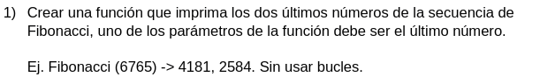
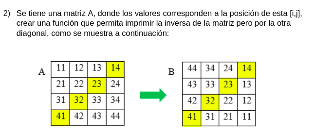
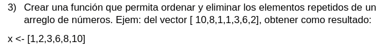

# Datathon the Interbank
Este cuaderno contiene las respuestas a las preguntas publicadas en la competencia Datathon de Interbank.

**Nombre del equipo:** Quatum Blockchain AI.

**Integrantes:**
- **Carlos Andres Alvarez:** *candres.alv@gmail.com* 
- **Cristian Garcia:** *cgarcia.e88@gmail.com*
- **David Cardozo:** *germancho27@gmail.com*
- **Sebastián Colinas:** *srcolinas@gmail.com*

## Estadística y de Cloud

**1. Qué emplearías para reducier la dimensionalidad de variables cualitativas?**

Para reducir la dimensionalidad de variables categoricas se puede usar [MCA](https://en.wikipedia.org/wiki/Multiple_correspondence_analysis) o [CAPTCA](https://www.ncbi.nlm.nih.gov/pubmed/22176263).

**2. Las metodologías que se utilizan para medir la eficacia de los modelos de propensión de variable cualitativa o modelos de clasificación son diversas, mencione 2 de ellas y las características fundamentales de ellas.**

Entre los métodos de clasificación sobresalen las redes neuronales (incluyendo su versiones convolucional y recurrente), los cuales se cacterizan por aprender características importantes para la clasificación a partir de los datos, lo cual se diferencia de otros métodos de machine learning; las redes neuronales además permiten modelar relaciones no lineales entre los datos. Otro método es la regresión logística, el cual está incialmente definido para problemas de clasificación binarios y permite estimar la probabilidad de una clase dados los datos, lo más importante de este método es que utiliza una función sigmoide para estimar esta probabilidad y que es un método lineal, por lo que usualmente requiere el diseño manual de algunas características relevantes para la clasificación.

**Nota:** consideramos que no se debe usar indistinguidamente las palabras categórica y cualitativa; nuestra respuesta la realizamos asumiento que se referían a variables categóricas, es decir, las que se intentan predecir con los modelos de clasificación.

**3. El modelamiento usualmente requiere alterar las muestras, esto es conocido como oversampling, luego del modelamiento, es posible corregir dichas probabilidades para volver a su distribución original? Cómo?**

Asumiendo que el modelo es una regresion logistica, la formula de correcion para el intercepto es

$
\alpha_0 = \alpha_1 + \log \frac{r_1( 1 - p_0)}{p_0 (1 - r_1) }
$

donde
* $\alpha_0$ es el intercepto de la distribucion original
* $\alpha_1$ es el intercepto de la distribucion con oversampling
* $r_1$ es la proporcion de las clases despues de oversampling
* $p_0$ es la proporcion de las clases antes de oversampling

Ahora solo tenemos que reemplazar este intercepto por el intercepto que encontro el algoritmo.

**Nota:** el oversampling no altera las muestras, altera la distrubucion de las caracteristicas sobre el conjunto de datos.

**4. Cuál es el valor agregado de un Modelo predictivo Bayesiano sobre un Modelo de Machine Learning?**
    
Los modelos Bayesianos permiten extraer intervalos de confianza sobre los resultados y al mismo tiempo permiten una mayor interpretabilidad de los resultados. 

**5. Mencione las diferencias y beneficios de trabajar con datos en la nube vs on premise.**

Trabajar en la nube permite trabajar con grandes volúmenes de datos de forma efectiva, así como la disponibilidad de de equipos de cómputo especializados como GPU. Sin embargo, se incurre en varios tipos de costos: administración de la plataforma en la nube, capacitación de los desarrolladores o científicos, costos de cómputo y costos de almacenamiento.

Por otro lado, trabajar *on premise* o en un entorno local, permite iterar más rápidamente sobre las alternativas de solución disponibles, aunque solo es efectivo cuando se tienen bajos volúmenes de datos y se itera con modelos pequeños.

## Programación 


```python
import numpy as np
import math
```




```python
def find_fibonacci_index(n):
    """
    Find the index of a given fibonacci number n.
    If the provided number is not an interger, it will be casted as such.
    
    """
    n = int(n)
    if n == 0:
        return 0
    elif n < 0:
        raise RunTimeError("Fibonnacci numbers are only defined for positive integers")
    else:
        eps = 10**-10
        phi = (1+math.sqrt(5))/2 
        fibonacci_index = int(round(math.log(n * math.sqrt(5)+eps)/math.log(phi)))
        return fibonacci_index

def fib(idx):
    phi = (1+math.sqrt(5))/2
    return math.floor((phi**idx)/math.sqrt(5) + 0.5)
        
def prev_two_fibonacci(n):
    """
    Find the previous two fibonacci's numbers given
    a fibonacci number.
    
    """
    if n <= 0:
        raise RuntimeError("Zero is the first fibonacci number")
    else:
        idx = find_fibonacci_index(n)
        return fib(idx-1), fib(idx-2)
```


```python
prev_two_fibonacci(6765)
```


    (4181, 2584)




**Nota**: consideramos que la pregunta está redactada equivocadamente. Según la imágen, se pregunta por la matrix transpuesta por la antidiagonal en lugar de la inversa.


```python
source = np.array([[11,12,13,14],[21,22,23,24],[31,32,33,34],[41,42,43,44]])
source
```


    array([[11, 12, 13, 14],
           [21, 22, 23, 24],
           [31, 32, 33, 34],
           [41, 42, 43, 44]])


```python
def transpose_antidiagonal(matrix):
    """Transpose a matrix by the antidiagonal.
    
    Args:
        matrix: a 2d numpy.ndarray
        
    Return:
        The transposed matrix
    """

    return matrix[::-1, ::-1].T
```


```python
transpose_antidiagonal(source)
```


    array([[44, 34, 24, 14],
           [43, 33, 23, 13],
           [42, 32, 22, 12],
           [41, 31, 21, 11]])





```python
def get_unique_and_sort(iterable):
    """Get a sorted list of the unique elements of iterable
    
    Args:
        iterable: a 1 dimensional array 
    
    Returns:
        A sorted list of the unique elements from the iterable
    """
    unique = set(iterable)
    ordered = sorted(unique)
    return ordered
```


```python
get_unique_and_sort([10,8,1,1,3,6,2])
```


    [1, 2, 3, 6, 8, 10]


**Nota:** segun la pregunta, asumiremos que el arreglo de entrada a la función tiene una sola dimensión
